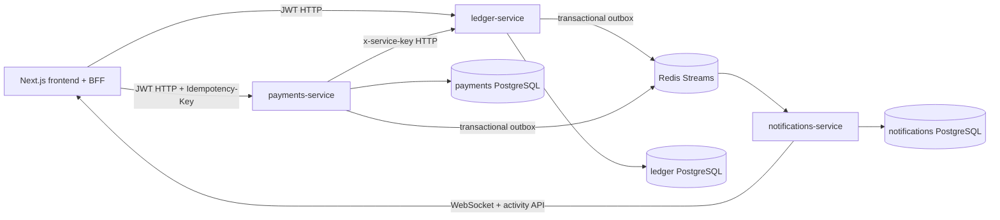

# **P2P Ledger**

Distributed Ledger & P2P Payments Platform built on NestJS, PostgreSQL, Redis Streams, and Next.js. The project implements an event-sourced ledger, a double-entry journal, an orchestrated transfer saga, FX, split bills, real-time notifications, and admin/reconciliation tooling.

## **Architecture**

### **Services**

| Service | Responsibility | Storage |
| :---- | :---- | :---- |
| ledger-service | Auth, wallets, events, projections, holds, journal, reconciliation | TypeORM \+ PostgreSQL |
| payments-service | Transfer saga, FX, compensation, retries, split bills, outbox | Prisma \+ PostgreSQL |
| notifications-service | Redis consumer, event deduplication, activity feed, WebSocket | Prisma \+ PostgreSQL |
| frontend | Next.js UI, BFF API routes, auth cookies, live transfer UI, admin | No dedicated DB |

There is no shared database reading and no XA transactions between services. Inside each service, standard local database transactions are used, while cross-service consistency is achieved via HTTP commands, outboxes, and Redis Streams.

## **Monetary Model**

The ledger-service serves as the single source of truth. The balance is not stored as a mutable CRUD field; instead, it is reconstructed via a fold operation over append-only ledger\_events. For concurrent commands, the wallet row is locked using pessimistic\_write, and the stream version is protected by a unique constraint on (streamId, version).  
Every financial operation writes journal lines with two sides, satisfying the invariant:

Plaintext  
sum(debit) \== sum(credit)

The ReconciliationService verifies journal totals and rebuilds the balance from the event stream. Admin endpoints include:

* GET /admin/reconciliation  
* GET /admin/wallets/:id/reconciliation  
* GET /admin/wallets/:id/events

Operations supported include placeHold, captureHold, releaseHold, credit, and compensation debit/credit. Ledger commands are idempotent based on commandId.

## **Transfer Saga**

An orchestrated saga pattern is used, with payments-service acting as the coordinator. Its state, steps, and retry metadata are stored in the payments database.

Plaintext  
lockFx  
  \-\> assertSenderCanPay  
  \-\> placeHold  
  \-\> captureHold  
  \-\> creditRecipient  
  \-\> complete

Compensations:

| Error | Compensation |
| :---- | :---- |
| FX stale / recipient not found / insufficient funds | Failed, funds were not reserved |
| placeHold failed | Failed, no hold placed |
| captureHold failed | Reconcile hold, then releaseHold or proceed if capture already passed |
| Credit after capture failed | refundSender via an idempotent ledger credit |
| Ledger/network unavailable | Circuit breaker, Compensating, retry with backoff and attempt limits |

Every saga transition is recorded in saga\_steps; the admin trace viewer displays status, duration, and an ordered step timeline.

## **FX & Split Bills**

FX rates are cached with a TTL, updated by a worker, and locked for the duration of a saga. Supported currencies include USD, EUR, and UAH.  
A split bill contains participants, shares, a due date, and an aggregated status of Pending \-\> PartiallyPaid \-\> Settled. Bill creation and share payments utilize an Idempotency-Key, with the creation key stored in the unique split\_bills.idempotencyKey field.

## **Events, Outbox & Real-Time**

The event envelope contains:

JSON  
{  
  "eventId": "uuid",  
  "type": "TransferCompleted",  
  "occurredAt": "ISO-8601",  
  "schemaVersion": "1",  
  "correlationId": "transfer-id",  
  "traceparent": "00-...",  
  "payload": {}  
}

Ledger and payments first save the event to their local database/outbox and then publish it to Redis Streams. The notifications consumer deduplicates events by eventId using processed\_events.  
The frontend receives transfer progress and notifications via Socket.IO. Upon reconnecting, an activity snapshot is loaded via /api/activity, ensuring the UI does not depend on the delivery of every missed WebSocket message.

## **API & Security**

Next.js API routes act as a BFF: they verify JWT cookies and proxy requests to the backend. A GraphQL gateway was omitted because, for this scope, a thin BFF maintains clear HTTP contracts without introducing an additional deployment unit.

* JWT access and refresh tokens are stored in httpOnly cookies on the frontend.  
* User wallet endpoints verify ownership.  
* The payments to ledger communication uses x-service-key.  
* Admin endpoints are protected by the admin JWT role or a server-side admin key for the trace endpoint.  
* DTOs pass through a ValidationPipe with whitelist and transform enabled.  
* Login and transfer endpoints are rate-limited via a throttler.  
* Idempotency keys and event IDs feature unique indexes.

## **Observability**

Every backend service includes:

* Structured JSON HTTP logs.  
* x-correlation-id and W3C traceparent headers.  
* A live Prometheus /metrics endpoint.  
* HTTP counters and histograms.  
* Payments saga step/duration metrics.  
* Notifications consumer metrics.  
* An optional OTLP exporter via OTEL\_EXPORTER\_OTLP\_ENDPOINT.

Trace context flows through the frontend BFF, payments-to-ledger HTTP calls, payments outbox, Redis envelope, and the notifications consumer. If an OTLP endpoint is not provided, services continue to function using correlation logs and Prometheus metrics.  
The admin frontend at /admin provides visibility into reconciliation, wallet drift, and recent transfer traces via /api/admin/traces.

## **Discovered Bugs & Fixes (Spec §3.2)**

### **1\. IDOR — Reading Another User's Wallet**

* **Problem:** The initial GET /wallets/:id endpoint returned the projection of any wallet without verifying ownership.  
* **Reproduction:** Obtain another user's wallet UUID and query the endpoint using a different user's JWT or without authorization in the starter version.  
* **Fix:** The user API now utilizes JwtAuthGuard and getOwnedById; unauthorized wallet requests return a 404\. For payments, a separate InternalWalletsController (GET /internal/wallets/:id) was added, protected by @ServiceAuth() and x-service-key.  
* **Proof:** The integration test suite verifies that a second user receives a 404 when attempting to read the first user's wallet.

### **2\. False-Positive Withdraw Test**

* **Problem:** The original test called service.withdraw(...).catch(...) without using await, allowing Jest to finish the test before checking for rejection.  
* **Fix:** Updated the test to use await expect(...).rejects.toBeInstanceOf(BadRequestException).  
* **Proof:** Included in the ledger unit test suite.

### **3\. Race Condition / Double-Spend**

* **Problem:** The initial read-modify-write pattern allowed two concurrent withdrawals to read the same old balance and pass validation simultaneously.  
* **Fix:** Implemented event sourcing, a database transaction, pessimistic\_write wallet locking, a non-negative projection guard, and a unique stream version constraint.  
* **Proof:** The integration test suite dispatches two concurrent transfers exceeding the available balance; exactly one completes as Completed, the second fails as Failed, and the balance remains non-negative.

## **Testing**

### **Unit Tests**

Bash  
cd apps/ledger-service && npm test \-- \--runInBand  
cd apps/payments-service && npm test \-- \--runInBand  
cd apps/notifications-service && npm test \-- \--runInBand

Coverage includes projection folding, authentication, service guards, double-entry journaling, reconciliation, saga happy/failure/compensation paths, FX, circuit breakers, outboxes, queues, event parsing, and notifications ACL/deduplication helpers.

### **Integration / Acceptance Tests**

After starting the Docker stack:

Bash  
docker compose up \-d \--build  
npm run test:integration  
bash scripts/integration-smoke.sh

scripts/integration-tests.mjs verifies authentication, IDOR prevention, same/cross-currency transfers, event logs, duplicate idempotency keys, concurrent double-spends, reconciliation, admin access, and duplicate Redis event delivery.

## **Running the Project**

Docker Desktop with Compose v2 is required:

Bash  
docker compose up \--build

Compose boots up three PostgreSQL instances, Redis, three backend services, and the frontend. Prisma migrations are automatically applied upon startup of the payments and notifications containers. Healthchecks prevent the frontend and payments services from starting until their dependencies are ready.  
URLs:

| Component | URL |
| :---- | :---- |
| Frontend | http://localhost:3000 |
| Ledger API / Swagger | http://localhost:3001 /docs |
| Payments API / Swagger | http://localhost:3002 /docs |
| Notifications API / Swagger | http://localhost:3003 /docs |
| Metrics | /metrics on each backend |

To run locally without Docker, copy .env.example to .env in each service directory. Within Docker Compose, the ledger uses ledger-db:5432; the local host port for the ledger is 5433\.

## **CI and Docker**

The GitHub Actions workflow at .github/workflows/ci.yml contains separate jobs for the frontend, payments, ledger, notifications, Docker image builds, integration stack, and quality checks. The quality job verifies TypeScript linting, formatting of CI/compose/integration files, compose schema validity, Dockerfiles via Hadolint, and workflows via Actionlint.  
Each application image includes a .dockerignore; Prisma images install OpenSSL, run prisma generate, and apply migrations before boot.

## **Limitations & Future Improvements**

* A full OTLP trace collector is not included in the compose setup: the exporter connects if OTEL\_EXPORTER\_OTLP\_ENDPOINT is specified, while correlation logs and metrics remain available locally.  
* The integration race-condition test runs against a local Docker stack and is not structured as a separate, long-running load-test environment.  
* The TypeORM ledger utilizes synchronize: true for educational purposes; production environments should transition to versioned TypeORM migrations.  
* The FX provider acts as a mock/cached provider, as permitted by the specification.  
* The frontend uses inline styles and does not claim to implement a full production design system.

## **Starter Code Modifications**

Ledger authentication contracts and the basic monorepo structure were preserved. The ledger wallet CRUD was replaced with an event store and projections; the payments skeleton was expanded with a saga, FX, compensation, split bills, and outbox; the notifications skeleton was built out with a consumer, deduplication, activity feed, and WebSockets; and the frontend received transfer, split bill, activity, and admin flows. Server components handle initial page loading, while client components handle WebSockets/live state and interactive forms. Transfer mutations are routed through the API with explicit Idempotency-Key headers.