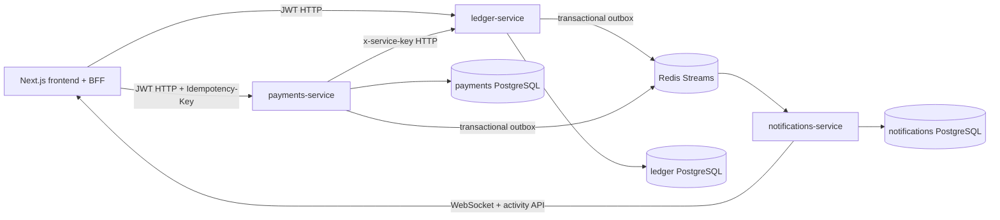

# P2P Ledger

Distributed Ledger & P2P Payments Platform на NestJS, PostgreSQL, Redis Streams
и Next.js. Проект реализует event-sourced ledger, double-entry journal,
оркестрированную saga переказу, FX, split bills, real-time notifications и
admin/reconciliation tooling.

## Архитектура



### Сервисы

| Сервис                  | Ответственность                                                    | Хранилище            |
| ----------------------- | ------------------------------------------------------------------ | -------------------- |
| `ledger-service`        | Auth, wallets, events, projections, holds, journal, reconciliation | TypeORM + PostgreSQL |
| `payments-service`      | Transfer saga, FX, compensation, retries, split bills, outbox      | Prisma + PostgreSQL  |
| `notifications-service` | Redis consumer, event deduplication, activity feed, WebSocket      | Prisma + PostgreSQL  |
| `frontend`              | Next.js UI, BFF API routes, auth cookies, live transfer UI, admin  | без собственной БД   |

Между сервисами нет общего чтения БД и нет XA-транзакций. Внутри сервиса
используется обычная транзакция собственной БД, а межсервисная согласованность
достигается через HTTP-команды, outbox и Redis Streams.

## Денежная модель

`ledger-service` является источником истины. Баланс не хранится как изменяемое
CRUD-поле: он восстанавливается fold-операцией из append-only `ledger_events`.
Для конкурентных команд wallet row блокируется `pessimistic_write`, а версия
потока защищена уникальностью `(streamId, version)`.

Каждая денежная операция пишет journal lines с двумя сторонами. Инвариант:

```text
sum(debit) == sum(credit)
```

`ReconciliationService` проверяет journal totals и повторно строит баланс из
event stream. Admin endpoints:

- `GET /admin/reconciliation`;
- `GET /admin/wallets/:id/reconciliation`;
- `GET /admin/wallets/:id/events`.

Поддерживаются `placeHold`, `captureHold`, `releaseHold`, credit и
compensation debit/credit. Команды ledger идемпотентны по `commandId`.

## Transfer saga

Использована оркестрированная saga: координатором является `payments-service`.
Её состояние, шаги и retry metadata хранятся в `payments` DB.

```text
lockFx
  -> assertSenderCanPay
  -> placeHold
  -> captureHold
  -> creditRecipient
  -> complete
```

Компенсации:

| Ошибка                                              | Компенсация                                                                  |
| --------------------------------------------------- | ---------------------------------------------------------------------------- |
| FX stale / recipient not found / insufficient funds | `Failed`, деньги не резервировались                                          |
| `placeHold` failed                                  | `Failed`, hold отсутствует                                                   |
| `captureHold` failed                                | reconcile hold, затем `releaseHold` или продолжение, если capture уже прошёл |
| credit после capture failed                         | `refundSender` через idempotent ledger credit                                |
| ledger/network недоступен                           | circuit breaker, `Compensating`, retry с backoff и лимитом попыток           |

Каждый переход saga записывается в `saga_steps`; admin trace viewer показывает
status, duration и ordered step timeline.

## FX и split bills

FX rates кэшируются с TTL, обновляются worker-ом и фиксируются на время saga.
Поддерживаются USD, EUR и UAH.

Split bill содержит участников, доли, due date и агрегированный статус
`Pending -> PartiallyPaid -> Settled`. Создание bill и оплата share используют
`Idempotency-Key`; ключ создания хранится в уникальном поле
`split_bills.idempotencyKey`.

## Events, outbox и real-time

Event envelope содержит:

```json
{
	"eventId": "uuid",
	"type": "TransferCompleted",
	"occurredAt": "ISO-8601",
	"schemaVersion": "1",
	"correlationId": "transfer-id",
	"traceparent": "00-...",
	"payload": {}
}
```

Ledger и payments сначала сохраняют событие в собственной БД/outbox, затем
публикуют его в Redis Streams. Notifications consumer дедуплицирует события по
`eventId` через `processed_events`.

Frontend получает transfer progress и notifications через Socket.IO. После
reconnect activity snapshot загружается через `/api/activity`, поэтому UI не
зависит от доставки каждого пропущенного WebSocket-сообщения.

## API и безопасность

Next.js API routes используются как BFF: они проверяют JWT cookie и проксируют
запросы в backend. GraphQL gateway не добавлялся, потому что для данного
объёма тонкий BFF сохраняет явные HTTP-контракты и не создаёт дополнительный
deployment unit.

- JWT access/refresh хранится в httpOnly cookies на frontend;
- пользовательские wallet endpoints проверяют владельца;
- payments → ledger использует `x-service-key`;
- admin endpoints защищены JWT role `admin` либо server-side admin key для
  trace endpoint;
- DTO проходят `ValidationPipe` с `whitelist` и `transform`;
- login и transfer endpoints ограничены throttler-ом;
- idempotency keys и event IDs имеют уникальные индексы.

## Observability

Каждый backend имеет:

- structured JSON HTTP logs;
- `x-correlation-id` и W3C `traceparent`;
- живой Prometheus `/metrics`;
- HTTP counters/histograms;
- payments saga step/duration metrics;
- notifications consumer metrics;
- optional OTLP exporter через `OTEL_EXPORTER_OTLP_ENDPOINT`.

Trace context проходит через frontend BFF, payments → ledger HTTP, payments
outbox, Redis envelope и notifications consumer. Если OTLP endpoint не задан,
сервисы продолжают работать с correlation logs и Prometheus metrics.

Admin frontend `/admin` показывает reconciliation, wallet drift и последние
transfer traces через `/api/admin/traces`.

## Найдені закладні баги (ТЗ §3.2)

### 1. IDOR — читання чужого гаманця

- **Проблема:** стартовый `GET /wallets/:id` отдавал проекцию любого wallet без
  проверки владельца.
- **Воспроизведение:** получить UUID чужого wallet и запросить endpoint с чужим
  JWT или без авторизации в стартовой версии.
- **Исправление:** пользовательский API использует `JwtAuthGuard` и
  `getOwnedById`; чужой wallet возвращает `404`. Для payments добавлен отдельный
  `GET /internal/wallets/:id` под `@ServiceAuth()` и `x-service-key`.
- **Доказательство:** integration suite проверяет, что второй пользователь
  получает `404` при чтении wallet первого.

### 2. Хибно-зелений тест withdraw

- **Проблема:** исходный тест вызывал `service.withdraw(...).catch(...)` без
  `await`, поэтому Jest мог завершить тест до проверки rejection.
- **Исправление:** тест использует
  `await expect(...).rejects.toBeInstanceOf(BadRequestException)`.
- **Доказательство:** тест входит в ledger unit suite.

### 3. Race / double-spend

- **Проблема:** стартовый read-modify-write позволял двум одновременным
  withdrawals увидеть один старый balance и оба пройти проверку.
- **Исправление:** event sourcing, DB transaction, `pessimistic_write` wallet
  lock, non-negative projection guard и уникальная stream version.
- **Доказательство:** integration suite отправляет два concurrent transfer на
  сумму, превышающую остаток; ровно один завершается `Completed`, второй
  `Failed`, а баланс остаётся неотрицательным.

## Тестирование

### Unit

```bash
cd apps/ledger-service && npm test -- --runInBand
cd apps/payments-service && npm test -- --runInBand
cd apps/notifications-service && npm test -- --runInBand
```

Покрыты projection fold, auth, service guard, double-entry journal,
reconciliation, saga happy/failure/compensation paths, FX, circuit breaker,
outbox, queue, event parsing и notifications ACL/dedup helpers.

### Integration / acceptance

После старта Docker stack:

```bash
docker compose up -d --build
npm run test:integration
bash scripts/integration-smoke.sh
```

`scripts/integration-tests.mjs` проверяет auth, IDOR, same/cross-currency
transfer, event log, duplicate idempotency key, concurrent double-spend,
reconciliation, admin access и duplicate Redis event delivery.

## Запуск

Требуется Docker Desktop с Compose v2:

```bash
docker compose up --build
```

Compose поднимает три PostgreSQL, Redis, три backend-сервиса и frontend.
Prisma migrations применяются при старте payments/notifications containers.
Healthchecks не дают frontend и payments стартовать до готовности зависимостей.

URLs:

| Компонент                   | URL                          |
| --------------------------- | ---------------------------- |
| Frontend                    | http://localhost:3000        |
| Ledger API / Swagger        | http://localhost:3001 /docs  |
| Payments API / Swagger      | http://localhost:3002 /docs  |
| Notifications API / Swagger | http://localhost:3003 /docs  |
| Metrics                     | `/metrics` на каждом backend |

Для локального запуска без Docker скопируйте `.env.example` в `.env` каждого
сервиса. Внутри Compose ledger использует `ledger-db:5432`; локальный host
порт для ledger — `5433`.

## CI и Docker

GitHub Actions workflow `.github/workflows/ci.yml` содержит отдельные jobs для
frontend, payments, ledger, notifications, Docker image build, integration
stack и quality checks. Quality job проверяет TypeScript lint, формат файлов
CI/compose/integration, Compose schema, Dockerfile через Hadolint и workflow
через Actionlint.

Каждый application image имеет `.dockerignore`; Prisma images устанавливают
OpenSSL, выполняют `prisma generate`, а migrations применяются перед boot.

## Что осталось / ограничения

- Полный OTLP trace collector не включён в compose: exporter подключается при
  заданном `OTEL_EXPORTER_OTLP_ENDPOINT`, а локально доступны correlation logs
  и metrics.
- Интеграционный race-тест запускается против локального Docker stack и не
  является отдельным длительным load-test стендом.
- TypeORM ledger использует `synchronize: true` для учебного проекта; для
  production следует перейти на versioned TypeORM migrations.
- FX provider является mock/cached provider, как допускает ТЗ.
- Frontend использует inline styles и не претендует на production design system.

## Стартовый код

Сохранены auth-контракты ledger и базовая структура монорепозитория. Ledger
wallet CRUD был заменён на event store и projections; payments scaffold получил
saga, FX, compensation, split bills и outbox; notifications scaffold получил
consumer, deduplication, activity и WebSocket; frontend получил transfer,
split, activity и admin flows. Server Components используются для начальной
загрузки страниц, а Client Components — для WebSocket/live state и интерактивных
форм. Мутации transfer идут через API с явным `Idempotency-Key`.
